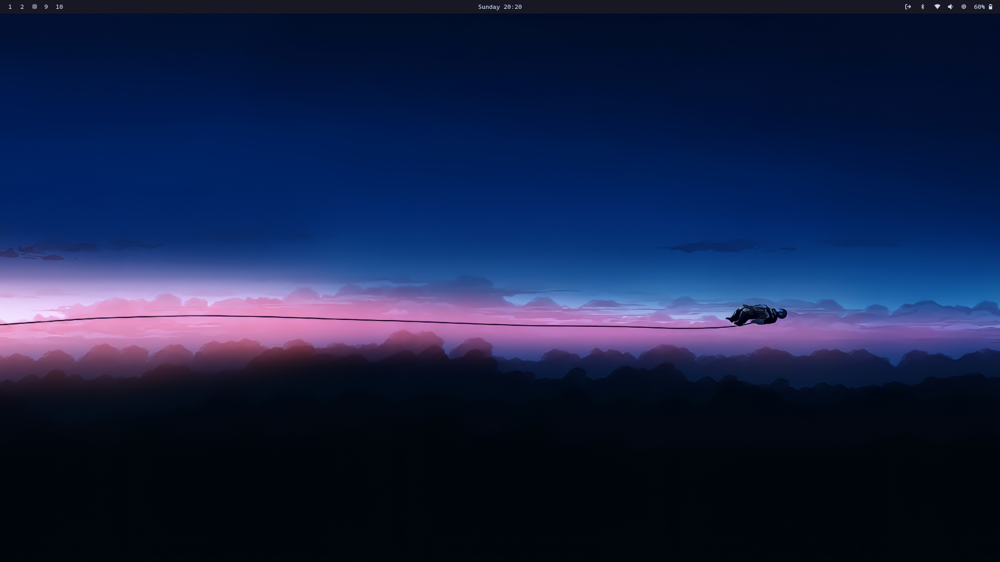
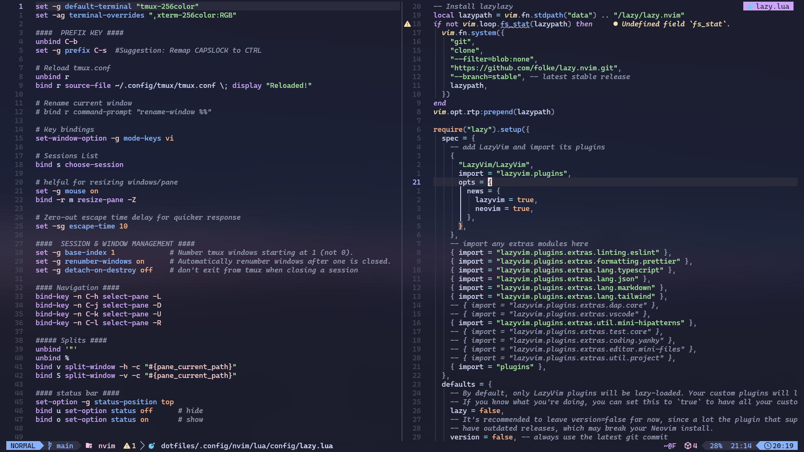

# MyDotfile



This is my personal configuration for a productive and enjoyable Linux environment. It's built around Hyprland on Arch Linux and includes tools I use daily. While I did take inspiration from various amazing dotfile setups shared by the community, these configs have been carefully tweaked by me to suit my own workflow and preferences.

## Tools Included

- **Hyprland** --- Wayland compositor I rely on for a smooth graphical experience
- **Kitty** --- My favorite terminal emulator, powerful and flexible
- **Alacritty** --- Another terminal I use; simple and fast, though it lacks image rendering
- **Lazygit** --- Handy terminal UI for Git operations
- **Neovim** --- The best text editor I’ve used, highly configurable
- **Walker** --- Application launcher
- **Waybar** --- Highly customizable status bar
- **Tmux** --- Terminal multiplexer to manage multiple sessions efficiently
- **Bash** --- The classic shell that still gets the job done
- **Starship** --- My shell prompt for a clean, informative terminal look (default config)
- **Xcompose** — Is a feature that allows users to input special characters by pressing a designated key

## Neovim & Tmux



## Installation Guide

### 1. Remove Old Configs (to avoid conflicts)

```
rm ~/.bashrc
rm ~/.Xcompose
rm ~/.config/starship.toml
rm -r ~/.config/alacritty
rm -r ~/.config/hypr
rm -r ~/.config/kitty
rm -r ~/.config/lazygit
rm -r ~/.config/nvim
rm -r ~/.config/tmux
rm -r ~/.config/waybar
rm -r ~/.config/walker
```

### 2. Clone the Repository

```
git clone https://github.com/theamit-969/dotfiles.git

cd dotfiles
```

### 3. Create Symlinks

From inside the `dotfiles` folder:

```
stow .
```

## What’s Next (TODO)

- [ ] automate Installation process
- [ ] obsidian purple colorscheme
- [x] customize Starship
- [ ] customize fish shell

<!-- ## What is Symlinking? -->
<!---->
<!-- Symlinking (symbolic linking) is like creating a shortcut.   -->
<!-- It **points from the location where your system expects configs** → **to the version inside your dotfiles folder**. -->
<!---->
<!-- - **Source:** the config in your dotfiles folder (e.g., `~/dotfiles/nvim`) -->
<!-- - **Target:** where the system looks for it (e.g., `~/.config/nvim`) -->
<!---->
<!-- This way, you update configs in one place and your system will always use the latest version. -->
