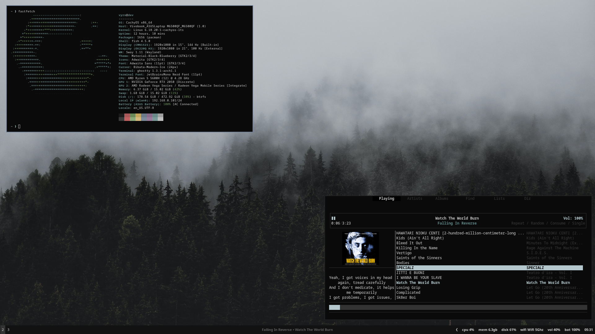
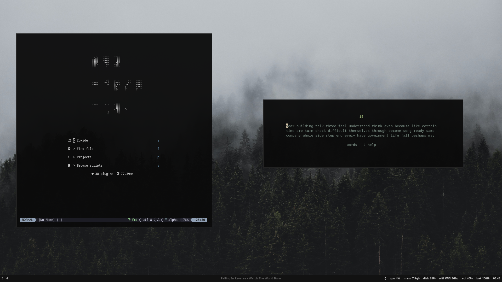
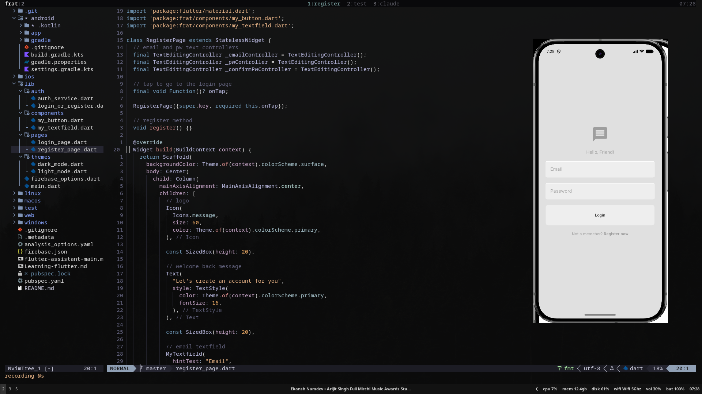

# dotfiles

This is a fairly boring setup focused on development work. Feel free to use whatever you would like from it, a mention would be nice if you find it useful.

Sway is my main compositor with animations and gaps disabled. Sometimes I switch to Niri for fun, it is a really good project.

## Setup





## Neovim + Tmux



## Usage

```
git clone https://github.com/vyrx-dev/dotfiles.git
cd dotfiles
stow .
```

## Highlights

- Neovim configured for Flutter/Dart, Go, Python, TypeScript with LSP, DAP debugging, Copilot + Codeium
- MPD + rmpc with auto-fetch lyrics from LRCLIB
- Kanshi for multi-monitor profiles
- Scripts for daily tasks like screen recording, screenshots, audio switching

## Other Stuff

- [symphony](https://github.com/vyrx-dev/symphony) - my other setup with more eye candy
- [wallpapers](https://github.com/vyrx-dev/Wallpapers) - my wallpaper collection
